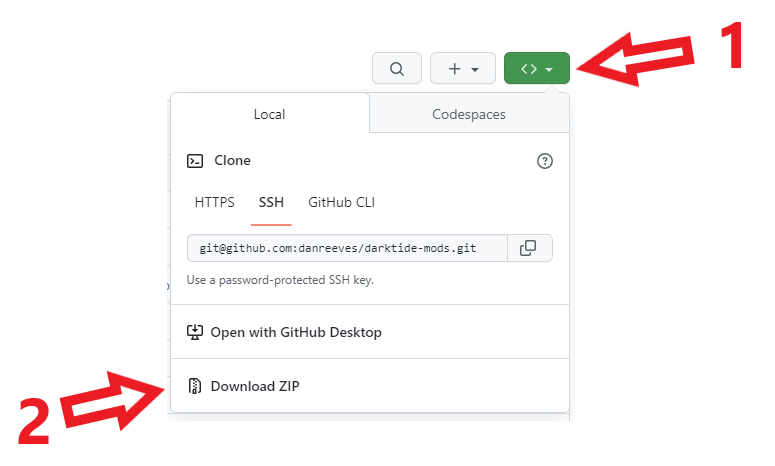

# raindish's darktide mods

### Installation

Download the zip and then drag the folders of the mods you want into your `mods` directory

## Log Me In

Automatically hits space for you at the title screen and automatically selects your current character
Includes a hotkey to cancel the character selections

[Download]()

## Healthbars

Show healthbars from the Psykanium in regular game modes, togglable by enemy class

[Download]()

## Numeric UI

Adds numbers to your HUD for team levels, ammo, health, and toughness

[Download]()

## Ping Monitor

Add your ping to the in game tab menu. Color indicates jitter.

[Download]()

## Taskbar Flasher

Flash the Windows taskbar icon when the game is not focussed and the game finishes loading or the AFK notice pops up

[Donwload]()

## Preview Cosmetics

View Premium Cosmetics on your current character

[Download]()

## Disable Screen Effects

Makes all the screen effects toggleable off (defaults to turning everything off)

[Download]()
